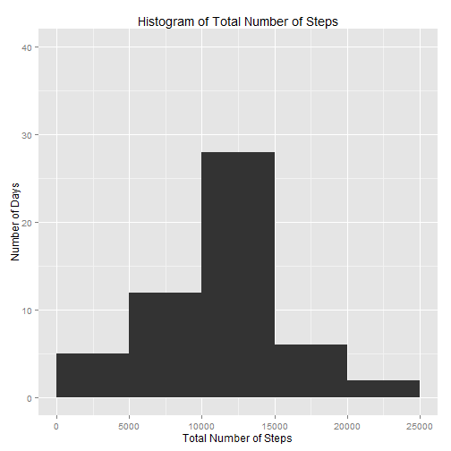

First we load 'activity.csv' into the data frame 'activ0'.  Then we create a new variable 'minute' containing minutes corresponding to intervals in the variable 'interval'.  For example, the interval 130 (i.e. 1:30) corresponds to the minute 90 of each day.  This way, we can use 'minute' instead of 'interval' in our time series plots, which results in uniform horizontal spacing between points.  We will, however, use 'interval' to label horizontal axes in those plots for ease of reference.


```r
activ0 <- read.csv("~/Coursera/activity.csv",stringsAsFactors=FALSE)
activ0$minute <- activ0$interval-floor(activ0$interval/100)*40
```

Next we create a new data frame 'activ1' containing the total number of steps taken each day.  We use the 'ggplot2' plotting system to make a histogram of the total number of steps taken each day.


```r
activ1 <- aggregate(steps~date,activ0,sum)
library(ggplot2)
qplot(steps,data=activ1,binwidth=5000,ylim=c(0,40),main="Histogram of Total Number of Steps",xlab="Total Number of Steps",ylab="Number of Days")+scale_x_continuous(limit=c(0,25000),breaks=seq(0,25000,5000))
```

 

The mean total number of steps is 10766.19 and the median total number of steps is 10765 as shown below.


```r
mean(activ1$steps)
```

```
## [1] 10766.19
```

```r
median(activ1$steps)
```

```
## [1] 10765
```

Then we create a new data frame 'activ2' containing the number of steps taken during each interval averaged across all days.  We make a time series plot of the average number of steps versus 'minute', but we label its horizontal axis with 'interval'.


```r
activ2 <- aggregate(steps~interval+minute,activ0,mean)
qplot(minute,steps,data=activ2,geom="line",main="Time Series Plot of Average Number of Steps",xlab="Interval",ylab="Average Number of Steps")+scale_x_continuous(breaks=seq(0,1440,360),labels=seq(0,2400,600))
```

 

We find that the interval 835 (i.e. 8:35) contains the maximum average number of steps.


```r
activ2$interval[activ2$steps==max(activ2$steps)]
```

```
## [1] 835
```

Next we determine the number of rows in 'activ0' in which numbers of steps are missing.  (Note that 2304 rows correspond to 8 days during which numbers of steps are missing.)


```r
sum(is.na(activ0$steps))
```

```
## [1] 2304
```

Our strategy for imputing the missing number of steps in each row is to use the average number of steps for that interval.  In other words, we use the average number of steps contained in 'activ2'.  To this end, we first create a vector 'activ3' by replicating the variable 'steps' 61 times, which is the number of days in October and November.  Then we impute missing numbers of steps in 'activ0' using 'activ3'.


```r
activ3 <- rep(activ2$steps,61)
activ0$steps[is.na(activ0$steps)] <- activ3[is.na(activ0$steps)]
```

We use new 'activ0' to update 'activ1', which contains the total number of steps taken each day.  The new histogram of the total number of steps is shown below.  It differs from the old histogram in only one aspect: the height of the middle bar for 10000-15000 total number of steps increases by 8, which is precisely the number of days with previously missing numbers of steps that are then imputed.  This is to be expected because the total number of steps for each of those 8 days (after missing numbers of steps are imputed) must be the same as the mean total number of steps, which is 10766.19.


```r
activ1 <- aggregate(steps~date,activ0,sum)
qplot(steps,data=activ1,binwidth=5000,ylim=c(0,40),main="Histogram of Total Number of Steps",xlab="Total Number of Steps",ylab="Number of Days")+scale_x_continuous(limit=c(0,25000),breaks=seq(0,25000,5000))
```

 

Consequently, the mean total number of steps does not change after missing numbers of steps are imputed.  The new median total number of steps equals the mean total number of steps as shown below.


```r
mean(activ1$steps)
```

```
## [1] 10766.19
```

```r
median(activ1$steps)
```

```
## [1] 10766.19
```

Next we create a new factor variable 'day' for 'activ0', which can be either 'weekday' or 'weekend' depending on 'date'.


```r
activ0$day <- weekdays(as.Date(activ0$date))
weekday <- c("Monday","Tuesday","Wednesday","Thursday","Friday")
weekend <- c("Saturday","Sunday")
activ0$day[activ0$day %in% weekday] <- "weekday"
activ0$day[activ0$day %in% weekend] <- "weekend"
activ0$day <- as.factor(activ0$day)
```

Then we create a new data frame 'activ4' containing the number of steps taken during each interval averaged across 'weekday' or 'weekend'.  Time series plots of the average number of steps for 'weekday' and 'weekend' are shown below.  Clearly, activities on weekends are delayed compared to those on weekdays.


```r
activ4 <- aggregate(steps~interval+minute+day,activ0,mean)
qplot(minute,steps,data=activ4,facets=day~.,geom="line",main="Time Series Plots of Average Number of Steps",xlab="Interval",ylab="Average Number of Steps")+scale_x_continuous(breaks=seq(0,1440,360),labels=seq(0,2400,600))
```

 
